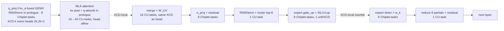

# Fleet-style Batch-1 Decode for DeepSeek-Coder-V2-Lite-Base on MI300X — Technical Design

Author: Kailun Chen · Status: v0.9 (pre-GPU; v0.8 is the submitted proposal, kept verbatim in `docs/task/`) · Target: single MI300X (gfx942), BF16, bs=1, 1024-token context, 32 greedy tokens

---

## 0. Summary

- Goal: execute one decode step as **one persistent HIP kernel** (Fleet task model: wavefront/CU/Chiplet/Device tasks, per-XCD scheduler, hierarchical events), starting from a validated MoE layer (index ≥ 1), extending to all 27 layers, then end-to-end greedy decode.
- Per-token active HBM traffic ≈ **4.94 GB** (weights 4.90 GB + MLA KV 33 MB). Bandwidth floor at 5.3 TB/s = **0.93 ms/token**; tuned target **2.5–3.5 ms/token** (290–400 tok/s, 29–40% of peak; Fleet's own dense-model result is 44%); first correct version expected 8–15 ms/token.
- Latency has three layers and the design targets them in order: (1) kernel launches and kernel-tail idle (~800 launches → 1 persistent kernel, ~8 ms), (2) cross-XCD event waits (task-level fusion and head-to-XCD affinity cut global events from 10 to 6 per layer, ~1 ms), (3) HBM bytes (4.94 GB, 1.24 ms — a floor fusion cannot move).
- Two model-specific deviations from the paper's dense-model graph: (1) **MoE expert tasks with device-side indirect expert index** (task queue stays immutable); (2) **absorbed MLA attention** with a compressed KV cache `[layer][pos][576]` shared by all 16 heads → the whole layer's cache (1.2 MB) is L2-resident per XCD.
- Reference prefill: HF `transformers` (trust_remote_code, eager) runs the 1,024-token prompt; a one-time conversion builds the compressed cache (excluded from timing).

---

## 1. Model analysis (DeepSeek-Coder-V2-Lite-Base)

Config values (from `config.json`; verify on download):

| Field | Value | Field | Value |
|---|---|---|---|
| hidden_size | 2048 | num_hidden_layers | 27 (layer 0 dense MLP, 1–26 MoE) |
| num_attention_heads | 16 (MLA, no GQA) | q_lora_rank | null (direct `q_proj`) |
| kv_lora_rank | 512 | qk_nope / qk_rope / v_head_dim | 128 / 64 / 128 |
| intermediate_size (layer 0) | 10944 | moe_intermediate_size | 1408 |
| n_routed_experts / n_shared_experts | 64 / 2 | num_experts_per_tok | 6 (greedy top-k, softmax, `norm_topk_prob=false`, scale 1.0) |
| vocab_size | 102400 | rope | YaRN, factor 40, orig 4096, θ=1e4 |
| rms_norm_eps | 1e-6 | dtype | bfloat16 |

Weight bytes per layer (bf16):

| Tensor | Shape | MB | Read per token? |
|---|---|---|---|
| q_proj | 2048×3072 | 12.58 | yes |
| kv_a_proj_with_mqa | 2048×576 | 2.36 | yes |
| kv_b_proj (W_UK ‖ W_UV) | 512×4096 | 4.19 | yes |
| o_proj | 2048×2048 | 8.39 | yes |
| attention subtotal | | **27.5** | |
| router gate | 2048×64 | 0.26 | yes |
| one routed expert (gate,up,down) | 3×2048×1408 | 17.3 | 6 of 64 |
| shared experts (merged) | 3×2048×2816 | 34.6 | yes |
| layer-0 dense MLP | 3×2048×10944 | 134.5 | yes |
| lm_head | 102400×2048 | 419.4 | yes |
| embed_tokens | 102400×2048 | 419.4 | 4 KB row |

Per-token traffic: layer0 162 MB + 26 × 166.2 MB + lm_head 419 MB = **4,902 MB**; KV (absorbed) 27 × 1056 × 576 × 2 B = 33 MB from HBM, on the premise that the 7 further reads by the other XCDs hit the 256 MB Infinity Cache (weights stream with `nt`, §4); without that premise it is 263 MB. Total ≈ 4.94 GB. Whole model ≈ 31.4 GB bf16 → fits 192 GB HBM with 160 GB headroom.

Roofline: decode FLOPs ≈ 2 × 2.45 G active params ≈ 4.9 GFLOP/token; MI300X bf16 peak ~1.3 PFLOPS → compute time 4 µs. Decode is **>200× memory-bound**; every design choice optimizes bytes moved and synchronization latency, not FLOPs.

---

## 2. Execution flow (one decode step, one MoE layer)

Absorbed-MLA decode math (per head h, position t over cache c ∈ R^{S×512}, k_pe ∈ R^{S×64}):

```
x_n   = RMSNorm(x)
q     = x_n · W_q                     # [16, 192] → q_nope[16,128], q_pe[16,64]
ckv   = x_n · W_kv_a                  # [576] → c_new[512], k_pe_new[64]
c_new = RMSNorm_kv(c_new); k_pe_new = RoPE(k_pe_new, pos); q_pe = RoPE(q_pe, pos)
cache[layer][pos] = c_new ‖ k_pe_new  # append
q_c[h] = q_nope[h] · W_UK[h]          # [512]   W_UK[h] ∈ R^{128×512}: rows [h·256, h·256+128) of kv_b_proj.weight
s[h,t] = scale · (q_c[h]·c[t] + q_pe[h]·k_pe[t]);  p = softmax_t(s)
o_c[h] = Σ_t p[h,t] c[t]              # [512]
o[h]   = o_c[h] · W_UV[h]^T           # [128]   W_UV[h] ∈ R^{128×512}: rows [h·256+128, h·256+256) of kv_b_proj.weight
x     += concat_h(o) · W_o
x_n2  = RMSNorm(x)
g     = softmax(x_n2 · W_gate); ids,w = topk6(g)   # no renorm, scale 1.0
y     = Σ_k w_k · E_{ids[k]}(x_n2) + E_shared(x_n2);  E(z) = (SiLU(z·W_g) ⊙ z·W_u) · W_d
x     += y
scale = qk_head_dim^-0.5 · mscale², mscale = 0.1·mscale_all_dim·ln(factor) + 1
```

RoPE must reproduce HF's DeepseekV2 interleave trick (`view(..., d/2, 2).transpose(-1,-2)` before `rotate_half`) — validated by unit test (§6).

---

## 3. Fleet task graph (per MoE layer, bs=1)



Task/event budget: **114 tasks (66 before split-KV), 6 global events + 24 XCD-local events per MoE layer** (16 attention→merge counters, 8 gate_up→down counters); 1,791 tasks (3,087 with split-KV) and 165 global events per token for the full model (27 layers, layer 0's dense gate_up→down needs the full h[10944] and is one extra global event, + embed + lm_head 8 Chiplet-tasks with final norm in prologue + argmax). Compare paper: 543 tasks/layer for dense Qwen3-8B.

Implementation note (v0.9): a Chiplet-task is *executed* as one descriptor per worker of the XCD, 37 per XCD, each carrying its worker id; the row split is a pure function of (xcd, worker, wave) and the event it signals has 8 × 37 = 296 producers. Nothing on the device broadcasts a task. The 66/114 figures above count Chiplet-tasks once per XCD; `taskgraph.py --report` prints both that count and the descriptor count (1,218 per MoE layer, 33,183 per token).

Solid arrows are global events, dashed are XCD-local. Four changes remove 4 global events per layer versus the unfused graph (10 → 6):

| Fusion | How | Redundant bytes |
|---|---|---|
| Pre-attention RMSNorm → q/kv_a GEMV prologue | every worker recomputes the norm of the 4 KB `x` vector before its tile | 0 |
| kv post (RMSNorm_kv, RoPE, cache append) → attention task prologue | the fused GEMV's 3648 output columns are split evenly (456 per XCD = 2 heads' 384 q columns + 72 kv_a columns); after the global event every attention task re-derives the new token's cache row from the raw 576-vector (2.3 KB fp32) and one designated task writes it to the cache | 8 × 2.3 KB ≈ 0 |
| q-absorb → attention task prologue | each attention task computes `q_c[h]` from its own W_UK[h] slice (131 KB); `q_pe[h]` gets its RoPE here too | 16 × 131 KB = 2.1 MB/layer read once; with 4 KV chunks the 3 extra reads are 6.3 MB/layer (3.8% of the layer's 166 MB), mostly L2 hits since a head's chunks share an XCD |
| Head-to-XCD affinity makes AT→MG XCD-local | XCD k runs the attention tasks (all KV chunks) and the merge+W_UV task of heads 2k, 2k+1, so the merge waits on an XCD-local counter; only o_proj (needs all 16 heads) is a global event. (The fused q‖kv_a GEMV itself is split into 8 × 456 rows regardless of head boundaries; q is read back after the global event, so its ownership is irrelevant.) | 0 |

Key mappings and why:

| Op | Task level | Partition | Rationale |
|---|---|---|---|
| GEMVs ≥ 8 MB (q/kv_a fused, o_proj, experts, lm_head) | Chiplet-task ×8 | N-split across XCDs, N-tiles across ~37 workers, K-chunked, fp32 accum, no cross-XCD reduction | Paper §4.1; bs=1 → `m_tiles=1`, gain is dispatch-count reduction, not L2 reuse |
| MoE experts | Chiplet-task ×8 | 8 balanced units: 6 routed (17.3 MB each) + shared split into 2 halves (17.3 MB each) | Perfect XCD balance; each XCD streams exactly one unit |
| gate_up → down inside one expert | intra-XCD | h[2816] written to L2-resident buffer; workers sync via XCD-local counter (paper §5.2 mech. 3) | Avoids a global fence between the two GEMVs |
| Expert selection | indirect descriptor | descriptor stores slot k; kernel reads `topk_ids[k]`, `topk_w[k]`; weight ptr = base + id·stride | Preserves Fleet's immutable pre-built task queue |
| MLA attention | CU-task ×16 (D2) → ×64 (D4) | first one task per head over all 1056 tokens (reads the full 1.2 MB cache; ~25 µs when pulled from HBM by one CU, ~10 µs for the second head on the same XCD served from L2); then (head, KV-chunk of 264) with flash-decoding partials (m, l, acc[512]) | Cache is shared across heads (MQA-like); 1.2 MB/layer fits 4 MB L2 → each XCD reads it from HBM/Infinity Cache once |
| Small ops (router, reduce, argmax) | CU-task ×1 | — | µs-scale; only those needing the full vector after a cross-XCD step stay standalone |
| Wavefront-tasks | fused | SiLU⊙up fused into gate_up epilogue; residual fused into GEMV epilogue | Paper: fusion lifts L2 hit rate 9.4%→17.4% at bs=1 by removing intermediate buffers |

Rejected alternatives:
- Pre-multiplying W_UV·W_o offline: 33.5 MB vs 10.5 MB read → 3.2× more traffic. Rejected.
- Non-absorbed MLA (materialize K/V per token): +283 MB cache read/token and extra 2 GFLOP; rejected for bs=1.
- Attention confined to 2 XCDs to avoid 8× redundant cache load: the redundancy is 9.8 MB/layer of Infinity Cache→L2 traffic, not HBM traffic (§1), and 8 XCDs give 4× more attention workers and head affinity; keep 8 XCDs.

---

## 4. Synchronization strategy

Four synchronization scopes from Fleet §5.2; the launch policy is MPK's AOT mode:

1. Task descriptors: built on host once, immutable, read without sync.
2. Task launch is ahead-of-time for every task: at bs=1 with fixed context and fixed top-6, no task has a data-dependent duration, so each worker's queue is filled once before launch (round-robin within its XCD, expert tasks by slot k) and a worker waits locally on its task's dependent event instead of being dispatched by a scheduler after the event fires. This is one synchronization hop per event (event → worker) instead of two (worker → scheduler → worker).
   The per-XCD scheduler therefore has one job: mirror global events into XCD-local flags. The scheduler workgroup (all four waves, one event per lane per pass) polls the global counters and copies each *count* into its XCD's mirror array; the 37 workers of that XCD poll the mirror. Global-counter polling traffic drops from 296 pollers to 8. The scheduler keeps a dedicated CU (1 of 38 per XCD, 2.6% of CUs), irrelevant in a bandwidth-bound regime. Whether the mirror actually stays L2-resident under the agent-scope protocol below is a D1 (b) measurement, not an assumption.
3. Worker→worker inside a Chiplet-task: XCD-local counter. Used for gate_up→down and for split-KV partial completion. *Implemented with the same agent-scope fences as 4; the fence-free variant is a planned optimisation.*
4. XCD→global event: two implementations, selected by D1 microbenchmark (a). Both use the same code path (agent-scope release fence on every producer, agent-scope atomic, agent-scope polling, acquire on the consumer); they differ only in where the counters live:
   - (i) ordinary device memory: the release fence's `buffer_wbl2` walks the XCD L2 for dirty lines.
   - (ii) counters in `hipExtMallocWithFlags(..., hipDeviceMallocUncached)` memory (MTYPE UC), so the atomic resolves at the Infinity Cache.
   *Not implemented:* last-worker-only flushing (every producer fences), `sc1` write-through payload stores, and explicit `nt`/`sc1` cache modifiers on weight streams; the cache-residency claims below therefore describe intent, to be checked against `rocprofv3` counters.

Residency: the kernel is launched with `hipLaunchCooperativeKernel` so all 304 workgroups are guaranteed co-resident (or the launch fails), which removes the scheduler-waits-for-absent-worker deadlock by construction. Scheduler waves run at `s_setprio 3`; polling loops insert `s_sleep 1` between reads to keep fabric traffic down.

XCD identity: every workgroup reads `HW_REG_XCC_ID` via `s_getreg_b32` (gfx942) to find its XCD's queue and flags; MI300X dispatches workgroups round-robin across 8 XCDs, so grid = 304 WGs (1 per CU) → 8 schedulers + 296 workers (37/XCD). Which workgroup is the scheduler is decided by an XCD-local arrival ticket, not by `blockIdx` — nothing guarantees `blockIdx` 0..7 land one per XCD — and a grid barrier checks that every XCD received exactly 38 workgroups, aborting with a reason code if not.

Memory model (v0.9, what the code actually does): MI300X L2 is per XCD and not coherent across XCDs for ordinary device memory, so every handshake follows the LLVM AMDGPU memory model for gfx942 rather than cache folklore — producers release with an agent-scope fence (`buffer_wbl2 sc1`), counters are agent-scope atomics, pollers use agent-scope atomic loads, consumers acquire with an agent-scope fence (`buffer_inv sc1`). XCD-local events use the same fences today; the fence-free L2-resident variant in item 3 above, and the L2-resident mirror in item 2, are optimisations D1 (b) has to justify with a measurement before they replace it. Waits carry a spin limit: a wait that never completes ends the launch with the event id instead of hanging the GPU.

Cache modifiers (paper §4.1): weights `sc1=1 nt=1` (streaming, no residency in L2 or Infinity Cache); activation stores `nt=1` (or `sc1` under event scheme ii); event polling non-temporal; intra-XCD counters volatile through L2. The 256 MB Infinity Cache then holds the 33 MB KV cache, router weights (7 MB across layers) and activations across the whole 32-token run instead of being churned by the 4.9 GB/token weight stream.

Determinism rule: no floating-point atomics anywhere. Cross-XCD reductions (expert partials, split-KV merges, argmax) use fixed-order reduce tasks → bitwise-reproducible output, which the correctness methodology relies on.

Launch model: v1 = one kernel launch per token (32 launches/32 tokens); v2 (stretch) = decode loop inside the kernel with a device-side step counter and the argmax task feeding the next embed task (1 launch total). Report both if reached.

---

## 5. Memory plan

| Buffer | Layout | Size | Notes |
|---|---|---|---|
| Weights | per-layer contiguous; experts `[layer][expert][gate_up ‖ down]`, gate_up interleaved as `[gate;up]` rows | 31.4 GB | ptr arithmetic `base + id·stride` for indirect expert tasks |
| KV cache (Fleet) | `[27][1056][576]` bf16, cols 0–511 = c, 512–575 = k_pe (post-RoPE) | 32.8 MB | 1024 prefill + 32 decode; no paging |
| Activations | fp32 buffers holding bf16-valued data at every point HF rounds (residual adds, every linear output, gate/up/SiLU products, logits), fp32 inside every task; x, x_norm [2048]; q‖kv_a [3648]; attn partials [16×chunks×514]; o [2048]; expert h `[8][1408]`; expert partials `[8][2048]`; topk ids/w; logits [102400]. Per-task scratch (normed x, cache row, q_c, q_pe, wave partials) is LDS, ~26 KB per workgroup | < 1 MB | all allocated once |
| Task queue + events | descriptors (33,183 × 64 B = 2.1 MB, or 34,479 with split-KV), per-XCD counters and mirrors, global event counters | ~2.3 MB | monotonic epochs already in v1: counters are never reset, the wait target is `epoch × producers` |

Prefill→decode interface:
- HF's DeepseekV2 reference caches full per-head K `[b,16,S,192]` and V `[b,16,S,128]` — incompatible with the absorbed path.
- Decision: register a forward hook on each layer's `kv_a_proj_with_mqa` during the reference prefill, capture `[S,576]`, apply `kv_a_layernorm` to cols 0–511 and RoPE(pos) to cols 512–575 by calling HF's own `apply_rotary_pos_emb` with cos/sin from the model's rotary module (no re-implementation of YaRN in the converter), write into the Fleet cache. One-time cost ≈ 27 × 1024 × 576 elements; excluded from decode latency.
- Validation of the conversion: reconstruct K,V from the converted cache with `kv_b_proj` and compare to HF's cache (max abs err ≤ 1e-2).

---

## 6. Correctness methodology

Reference: HF `transformers` `DeepseekV2ForCausalLM`, bf16, `attn_implementation="eager"`, same GPU; fp32 CPU run of 2 layers for tie-breaking. Fixed prompt, `torch.manual_seed(0)`, deterministic flags.

Gates (bf16 mantissa 8 bits → 0.39% per-element rounding; K=2048 fp32-accumulated GEMV → expected output relative error ≤ 1%):

| Boundary | Check | Pass threshold |
|---|---|---|
| Each Fleet task vs torch op (random + real inputs) | max‖Δ‖∞/‖ref‖∞, cosine | ≤ 1e-2, ≥ 0.9999 |
| Router | top-6 ids | exact match; log score margin between rank 6 and 7 |
| Layer L output given golden input | hidden state | max rel ≤ 2e-2, cosine ≥ 0.999 |
| Layers 1..N consecutive (Fleet output feeds Fleet) | hidden state vs HF per layer | drift curve reported; cosine ≥ 0.999 at N |
| Decode step, teacher-forced (golden previous token) | logits argmax | equal; log top-2 margin |
| Free-running 32 tokens | token ids vs HF greedy | target 32/32; report first divergence and its logit margin |
| Determinism | 3 runs | bitwise identical outputs |

Every completed boundary ships with a `tests/test_<boundary>.py` that prints the numbers above and exits non-zero on failure.

---

## 7. Implementation milestones (5 days)

| Day | Deliverable | Exit criterion |
|---|---|---|
| D0 (local, no GPU) | this doc; `model_analysis.py` (byte accounting from config); `taskgraph.py` generating descriptors + DAG validation + buffer plan; numpy absorbed-MLA decode reference on tiny random config vs HF CPU; KV conversion script tested on tiny config; HIP task kernels compiled offline with `hipcc --offload-arch=gfx942` (docker `rocm/dev-ubuntu-22.04`) | tiny-config decode matches HF CPU ≤ 1e-2 |
| D1 | env: `rocm/pytorch` image (ROCm ≥ 6.4), model download (31 GB), HF reference run → golden hidden states + 32 tokens; own runtime skeleton (§8); persistent-kernel smoke test with XCD discovery; **3 microbenchmarks**: (a) cross-XCD event round-trip for both schemes in §4 (wbl2 vs write-through + uncached counters), (b) XCD-local flag latency (event mirroring), (c) single-worker register-streamed GEMV bandwidth vs outstanding-load depth and tile size; hybrid harness (any task replaceable by a torch op between launches) | reference goldens saved; empty graph runs; §9 sync and bandwidth figures replaced by measurements |
| D2 | AOT worker queues + event mirroring; register-streamed Chiplet-task GEMV validated; fused-norm prologue, kv-post and absorb in attention prologue, RoPE, 16-task attention validated; **attention block of layer 1** validated | per-op gates pass |
| D3 | router, indirect expert Chiplet-tasks, L2-local gate_up→down, reduce, cross-task prefetch on static-address tasks; **full MoE layer 1 validated through Fleet path** (required milestone) | layer-1 gate passes |
| D4 | layers 1..26 persistent; layer 0 dense via same GEMV tasks; embed, lm_head, argmax; e2e 32-token attempt; split-KV attention (64 tasks); per-task timestamp trace → XCD Gantt; profiling (`rocprofv3 --kernel-trace --pmc`) | N consecutive layers reported; e2e if reached; Gantt shows where the remaining bubbles are |
| D5 | final report per §10, reproducibility scripts | `run_all.sh` reproduces every number in the report |

---

## 8. Runtime choice

Own runtime (~1k lines HIP). The public `ROCm/fleet-chiplet-megakernel` is the Mirage Persistent Kernel compiler with Fleet's scheduling added (`include/mirage`, `deps/rocblas`, kernel emitted by the Mirage Python pipeline into `permanent_output_dir`); its only demo is Qwen3-8B and it lists gfx950 / ROCm 7.0+ as the hardware requirement. Expressing MoE routing and absorbed MLA there would mean extending the Mirage graph compiler, not writing tasks. The own runtime implements §4 verbatim — per-XCD queues, XCD-local counters, last-worker `buffer_wbl2` + global counter, exactly the protocol the repo README documents — behind a 3-function interface (`fetch_task`, `wait_event`, `signal_event`), so task code is runtime-agnostic. The repo serves as the reference for protocol semantics and for calibration (§9), not as a build dependency.

---

## 9. Expected performance (falsifiable)

| Quantity | Value | Basis |
|---|---|---|
| Bytes/token | 4.94 GB | §1 accounting |
| Floor @ 5.3 TB/s | 0.93 ms | peak HBM |
| Floor @ 4.0 TB/s (76% achievable, streaming loads) | 1.24 ms | AMD stream microbenchmark on MI300X SPX/NPS1: 4,017 GB/s (ROCm blog, Feb 2025); confidence H |
| Sync overhead | ~166 global events × 2–4 µs ≈ 0.3–0.7 ms | 3–6 µs is the two-hop (worker→scheduler→worker) figure; AOT launch with event mirroring is one hop; confidence L until D1 microbenchmarks (a)(b). Event count is in line with Fleet's own graph: 1,830 per-XCD signals per token on Qwen3-8B = ~229 global events |
| Calibration: Fleet on Qwen3-8B bs=1 | 7.0 ms/token for 16.4 GB → 2.3 TB/s = 44% of peak (MI350, same 5.3 TB/s) | repo README reproduction table |
| Calibration: MPK on A100, Qwen3-8B bs=1 | 12.5 ms vs 10 ms bound → 80% of peak | MPK paper §6.3 |
| Calibration: hand-built Llama-1B megakernel on H100 | 78% of peak | Hazy Research blog, May 2025 |
| Why AMD lands lower | per-token byte time on MI300X is 3.3× shorter than on A100 for the same bytes, so the same microseconds of event latency cost 3.3× more of the budget; the design therefore spends its effort on event count (6/layer) and event hops (AOT launch + mirroring, §4) rather than on GEMV tile tuning | derived from the three rows above |
| First correct e2e | 8–15 ms/token | untuned tiles, serialized small ops |
| Tuned target | 2.5–3.5 ms/token, 290–400 tok/s | = 29–40% of peak, slightly below Fleet's 44% on a dense model; MoE streams 17 MB per XCD per expert phase instead of 100 MB+ dense GEMMs, so tile tails weigh more |
| Launches/token | 1 (v1) → 1/32 tokens (v2) | vs ≈800+ for per-op execution (27 layers × ~30 kernels) |

Dominant risk to the target: expert GEMV efficiency at N-tile granularity (17.3 MB per XCD, ~470 KB per worker) and the fence+signal cost at each of the 6 global events per layer.

---

## 10. Metrics: collection and reporting

| Metric | Command / mechanism |
|---|---|
| Correctness error | `tests/*.py` (§6); on device `fleet_decode --teacher-force` (per-step token check) and free-running decode vs `golden_tokens.txt` |
| Fleet-native ops / fallbacks | `taskgraph.py --report` prints per-op {fleet, torch-fallback} |
| Consecutive layers | *planned:* per-layer hidden-state dump from the launcher against `golden.npz` (first-decode-step states are already captured) |
| GPU launches | `rocprofv3 --kernel-trace -o trace -- ./build/fleet_decode` → count per token |
| Median / P95 latency | `fleet_decode --json` records `hipEvent` time per token; `--smoke` isolates the synchronisation cost |
| Per-XCD timeline | *planned:* every task writes start/end `s_memrealtime` + XCD id to a trace buffer; a `bench/gantt.py` renders 8 XCD lanes per token, exposing bubbles, imbalance and tails |
| Memory traffic / bandwidth | `rocprofv3 --pmc FETCH_SIZE WRITE_SIZE` (gfx942 TCC counters); achieved BW = bytes / kernel time |
| Occupancy / resources | `hipcc -Rpass-analysis=kernel-resource-usage` (VGPR/SGPR/LDS), `rocprofv3 --pmc SQ_WAVES SQ_BUSY_CYCLES GRBM_GUI_ACTIVE` |
| TPOT / tok/s | derived from e2e run |

The D5 report presents these as follows; no estimate from §9 survives into it unmeasured.

| Section | Content | Source |
|---|---|---|
| Milestone | exact consecutive-layer count; e2e reached or not; per-op list of Fleet-native vs torch-fallback | `taskgraph.py --report`, the planned per-layer dump |
| Correctness | §6 table with measured values at every completed boundary; drift curve over layers; first divergent token and its logit margin if any | `tests/*.py` |
| Per-layer XCD Gantt | 8 lanes per layer, one figure per layer type (dense, MoE, lm_head); every idle interval classified as (a) global-event wait — worker idle between its XCD's signal and the next dispatch, (b) tile tail — inside a Chiplet-task, workers idle after their tile while the last tile finishes, (c) XCD imbalance — an XCD's Chiplet-task ends before the slowest XCD's. Reported as % of layer time and aggregated per token | *planned:* per-task and per-event `s_memrealtime` trace; classifier in a `bench/attribution.py` |
| Achieved bandwidth by phase | bytes ÷ phase time for q/kv_a, o_proj, expert, lm_head GEMV phases, the attention phase and the small-op phase, each against the 4.0 TB/s ceiling; the phase farthest from the ceiling is named with its cause (tile size, in-flight depth, or sync) | bytes per phase from the §1 accounting (static), phase time from the trace timestamps; `rocprofv3 --pmc FETCH_SIZE` validates the per-token total only — hardware counters aggregate per dispatch and cannot be split inside one persistent kernel |
| Next five days | ordered list; each item = change, expected gain, and the measured bubble or bandwidth gap in the two rows above that it is derived from. Items whose gain cannot be tied to a measurement are not listed | derived |
| Known failures | reproducible failing cases with the boundary at which they appear | `tests/` |

---

## 11. Known risks and fallbacks

| Risk | Mitigation / fallback |
|---|---|
| Own runtime diverges from Fleet semantics | protocol copied from repo README / paper §5.2 (per-XCD queues, L2-local counters, last-worker wbl2 + global counter); D1 microbenchmark (a) checks event latency is in the paper's range |
| RoPE / YaRN constant mismatch vs HF | unit test against HF module output on the same inputs before any layer test |
| Router top-k mismatch on near-ties | log margins; teacher-forced decode isolates it from later layers |
| Union kernel exceeds the 512 VGPR+AGPR budget of one wave and spills (1 wave/SIMD is the design: one 256-thread WG per CU) | measure with `-Rpass-analysis`; `__launch_bounds__(256,1)`; rarely-used ops (argmax, router) as `noinline` functions so their registers are not live in the GEMV loop |
| Persistent kernel deadlock (scheduler WG not resident) | `hipLaunchCooperativeKernel` with grid = 304 (residency guaranteed by the runtime); D1 barrier smoke test confirms 1 WG per CU |
| TLB reach: 16,384 entries × 4 KB = 64 MB per XCD, ~47 ns miss penalty (Chips and Cheese) vs 4.9 GB streamed per token | verify that `hipMalloc` weight buffers are mapped with 2 MB fragments (rocprofv3 TLB-miss counters on D1 (c)); if not, allocate weights with `hipMallocManaged` + `hipMemAdvise` coarse-grained or 2 MB-aligned `hipExtMallocWithFlags` |
| Time: e2e not reached | report exact layer count reached; lm_head/embed as torch fallback is documented as such |

---

## 12. Planned optimizations (ordered by expected gain)

| Optimization | Mechanism on MI300X | Effect |
|---|---|---|
| Tile-granular producer/consumer inside expert tasks | Each gate_up worker increments an XCD-local counter per finished N-tile; down workers accumulate over each completed K-chunk of `h[2816]` as it lands, polling the counter through L2 (no fence) | Removes the tail of the ~23 µs gate_up phase before down can start; est. ≤10 µs/layer |
| Interleaved gate/up weight layout | Offline repack expert `[gate;up]` rows so each lane holds adjacent gate/up pairs; SiLU⊙up computed in registers, result written directly as bf16 `h` | No cross-lane shuffle, no LDS round-trip in the epilogue |
| Register-streamed GEMV (no LDS staging) | Weights go HBM → VGPR directly with `global_load_dwordx4` (1 KB per wave-instruction; gfx942 LDS DMA is only 4 B/lane, 256 B per instruction). Little's law: 18 GB/s per CU (5.3 TB/s ÷ 296 workers) × ~1 µs HBM load-to-use (Infinity Cache hit alone is ~218 ns) = 18 KB in flight per CU → 4 waves × 5 outstanding dwordx4, 2× margin planned; `vmcnt` limit 63, register file 512 KB/CU. Chunk k+1 loads are issued before chunk k's FMAs; `s_waitcnt vmcnt(N)` retires exactly one chunk | Prerequisite for ≥75% of HBM peak on 17 MB per-XCD streams; 4× fewer load instructions than LDS staging |
| Monotonic event epochs (implemented in v1) | Event counters never reset; wait condition `G[e] ≥ epoch × producers`, with `producers` carried on the waiting descriptor; enables the in-kernel 32-token loop (v2) with a single launch | Removes per-token counter reset; v2 removes the launch |
| Cross-task prefetch (next task's first chunk) | With AOT queues a worker knows its next task before the current one ends; for every task except routed experts the weight address is static, so the worker issues the next task's first K-chunk loads (≤ 18 KB, §12 row 3) while draining the current task's FMAs and waits on the next event only when the loads are already in flight. Routed-expert tasks prefetch nothing (expert id unknown until the router event). | The event wait overlaps with HBM latency instead of preceding it; this is the mechanism behind the 78–80% results on NVIDIA megakernels. D3 for attention/o_proj/shared-expert tasks |

Implementation order: register-streamed GEMV + fused prologues + AOT queues with event mirroring (D2) → interleaved gate/up + tile-granular counters + cross-task prefetch (D3) → split-KV, epochs + in-kernel loop (D4, if e2e reached).
